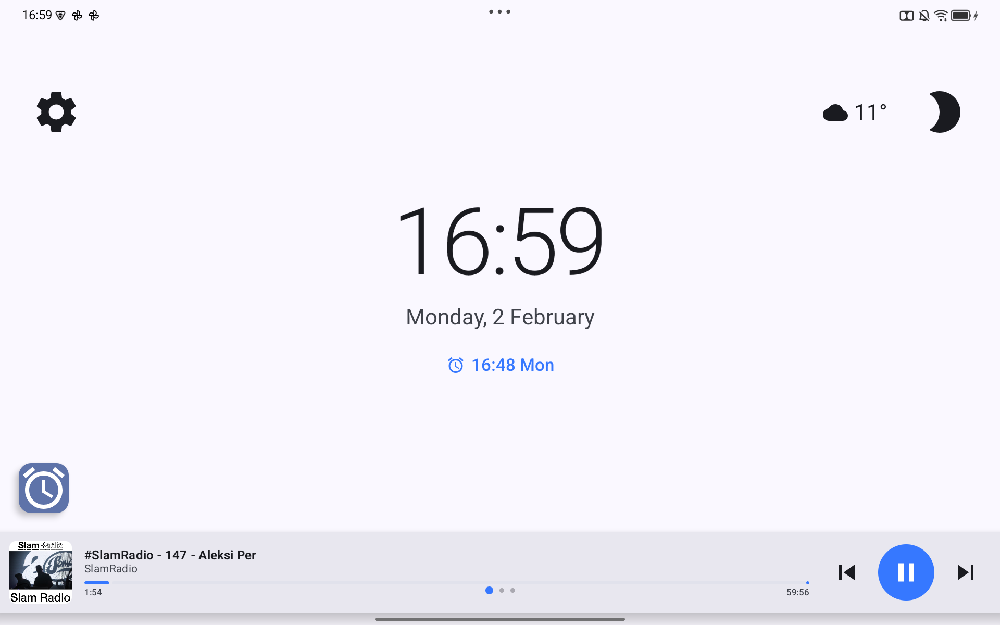
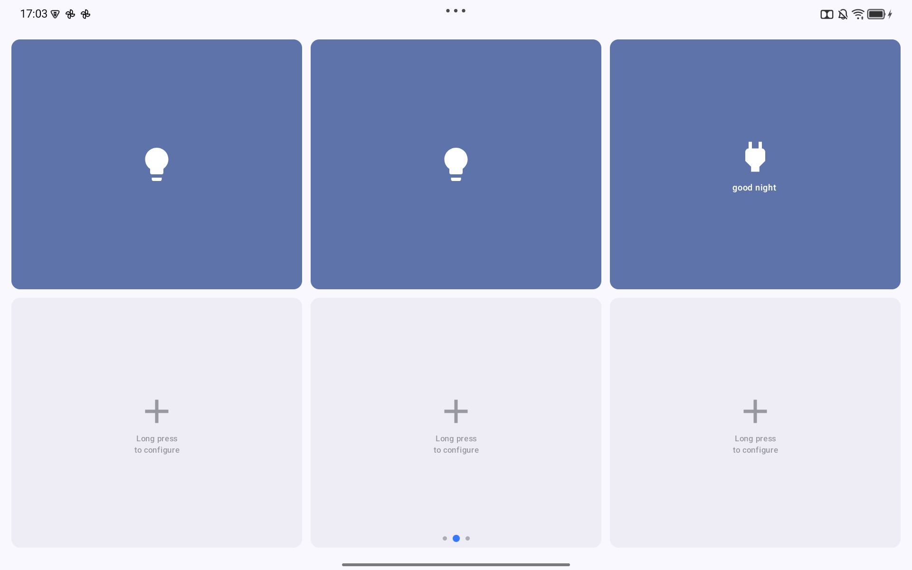
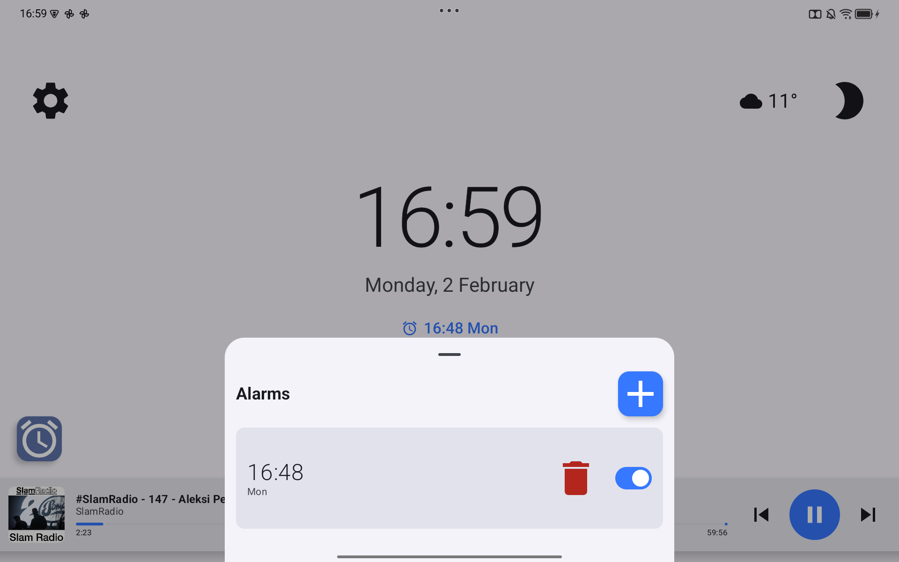
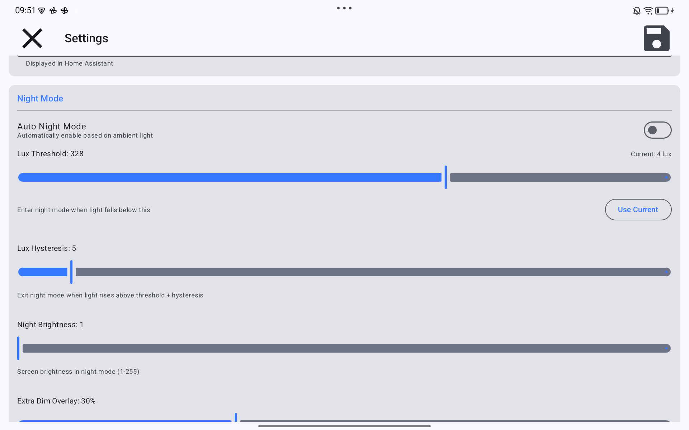
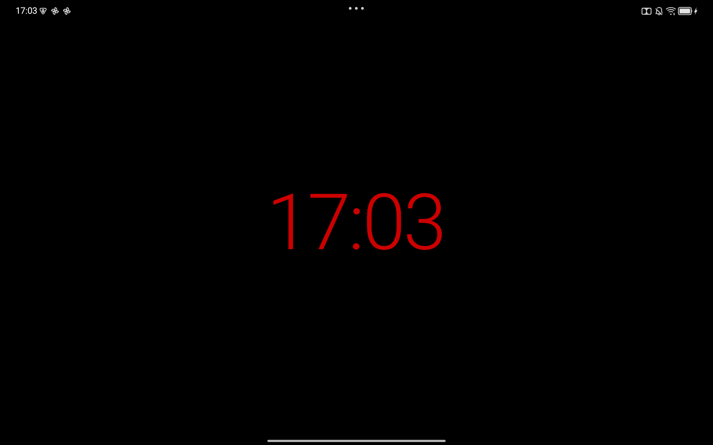

# TabletHub

An Android tablet app designed as an always-on dashboard to replace a Nest Hub. It serves as a bedside/kitchen dashboard with alarm clock, Home Assistant controls via MQTT, and Plex music playback.

## Screenshots

| Clock | Quick Actions | Music Library |
|-------|---------------|---------------|
|  |  |  |

| Alarms | Settings | Night Mode |
|--------|----------|------------|
|  |  |  |

## Tech Stack

- Language: Kotlin
- UI: Jetpack Compose with Material 3
- Min SDK: 29 (Android 10), Target SDK: 34
- MQTT: Eclipse Paho
- Media: AndroidX Media3 / ExoPlayer
- Database: Room
- DI: Hilt
- Networking: Retrofit + Moshi

## Core Features

1. **Clock & Alarms** - Large clock display, alarm management, pre-alarm HA triggers
2. **Quick Actions** - Configurable button grid for HA service calls
3. **Music Player** - Plex integration with library browsing and playback
4. **Night Mode** - Ambient light sensor-based auto-dimming with color temperature control
5. **Photo Slideshow** - Future: Google Photos integration

## Home Assistant Integration

The app registers as an HA device via MQTT discovery, exposing:

**Sensors:**
- `sensor.tablethub_next_alarm` - Next scheduled alarm time (attributes: alarm_label, alarm_id)
- `sensor.tablethub_alarm_countdown` - Minutes until next alarm (updates every 60 seconds)
- `sensor.tablethub_battery` - Battery level % (attributes: charging)
- `binary_sensor.tablethub_alarm_ringing` - ON when alarm is actively ringing

**Switches:**
- `switch.tablethub_screen` - Turn screen on/off
- `switch.tablethub_night_mode` - Toggle night mode (dims screen, restores brightness on exit)
- `switch.tablethub_alarm_*` - Enable/disable individual alarms

**Lights:**
- `light.tablethub_brightness` - Screen brightness control (0-255)

**Numbers:**
- `number.tablethub_color_temp` - Color temperature warmth (0-100%, amber overlay for eye comfort)

**Buttons:**
- `button.tablethub_dismiss_alarm` - Dismiss currently ringing alarm
- `button.tablethub_trigger_alarm` - Manually trigger the alarm

**Media Player:**
- `media_player.mqtt_media_player_tablethub_music` - Plex music playback (requires bkbilly integration)

**Device Triggers:**
- Shortcut button presses are exposed as device triggers for automations

### Pre-Alarm Events

The app publishes pre-alarm events to `tablethub/{device_id}/event` before an alarm fires. Use these to trigger automations like gradually turning on lights.

**Event payload:**
```json
{
  "event_type": "tablethub_pre_alarm",
  "alarm_id": "1",
  "alarm_time": "07:00",
  "alarm_label": "Wake up",
  "minutes_until": 15
}
```

**Example automation - Sunrise lights before alarm:**
```yaml
automation:
  - alias: "TabletHub - Sunrise lights before alarm"
    trigger:
      - platform: mqtt
        topic: "tablethub/tablethub/event"
    condition:
      - condition: template
        value_template: "{{ trigger.payload_json.event_type == 'tablethub_pre_alarm' }}"
    action:
      - action: light.turn_on
        target:
          entity_id: light.bedroom
        data:
          brightness_pct: 1
      - repeat:
          count: 14
          sequence:
            - delay: "00:01:00"
            - action: light.turn_on
              target:
                entity_id: light.bedroom
              data:
                brightness_pct: "{{ (repeat.index + 1) * 7 }}"
```

### Media Player Setup

The media player entity requires the [bkbilly/mqtt_media_player](https://github.com/bkbilly/mqtt_media_player) custom integration:

1. Install via HACS or manually
2. Restart Home Assistant
3. Go to Settings → Devices & Services → Add Integration → MQTT Media Player
4. The TabletHub media player should appear automatically

### Controlling the Media Player

**Basic controls:**
```yaml
# Play/pause
action: media_player.media_play_pause
target:
  entity_id: media_player.mqtt_media_player_tablethub_music

# Next/previous track
action: media_player.media_next_track
action: media_player.media_previous_track

# Set volume (0.0 to 1.0)
action: media_player.volume_set
data:
  volume_level: 0.3
target:
  entity_id: media_player.mqtt_media_player_tablethub_music
```

**Play a playlist by name:**
```yaml
action: media_player.play_media
data:
  media_content_id: "My Playlist Name"
  media_content_type: playlist
target:
  entity_id: media_player.mqtt_media_player_tablethub_music
```

### Weather Widget

The clock screen displays a weather widget showing temperature and condition from Home Assistant sensors.

**1. Create template sensors** (Settings → Devices & Services → Helpers → Create Helper → Template sensor):

Temperature sensor:
- Name: `Weather Temperature`
- State template: `{{ state_attr('weather.home', 'temperature') | round(0) }}`
- Unit: `°C` or `°F`

Condition sensor:
- Name: `Weather Condition`
- State template: `{{ states('weather.home') }}`

Replace `weather.home` with your weather entity ID (find it in Developer Tools → States).

**2. Publish sensors via MQTT Statestream** (add to `configuration.yaml`):
```yaml
mqtt_statestream:
  base_topic: homeassistant/statestream
  include:
    entities:
      - sensor.weather_temperature
      - sensor.weather_condition
```

The widget will automatically display in the top-right corner of the clock screen when data is available.

### Text-to-Speech (TTS)

The tablet can speak announcements using Android's native TTS engine. Send text via MQTT and the tablet will speak it aloud, automatically ducking any playing music.

**Simple announcement:**
```yaml
action: mqtt.publish
data:
  topic: tablethub/tablethub/tts
  payload: "Hello, this is a test announcement"
```

**JSON format (with optional language):**
```yaml
action: mqtt.publish
data:
  topic: tablethub/tablethub/tts
  payload: '{"message": "Bonjour", "language": "fr-FR"}'
```

**Weather announcement script with forecast:**

Create a script (Settings → Automations & Scenes → Scripts → Add Script → Edit in YAML):
```yaml
alias: Announce Weather
sequence:
  - action: weather.get_forecasts
    target:
      entity_id: weather.home_2
    data:
      type: daily
    response_variable: forecast
  - action: mqtt.publish
    data:
      topic: tablethub/tablethub/tts
      payload: >
        Good morning! It's currently {{ state_attr('weather.home_2', 'temperature') | round(0) }} degrees
        and {{ states('weather.home_2') }}.
        Today's high is {{ forecast['weather.home_2'].forecast[0].temperature | round(0) }}
        and the low is {{ forecast['weather.home_2'].forecast[0].templow | round(0) }} degrees.
```

Replace `weather.home_2` with your weather entity ID (find it in Developer Tools → States).

### Night Mode & Color Temperature

**Night Mode** dims the screen to a low brightness level (default 5/255) for bedside use. When disabled, the previous brightness is automatically restored.

**Auto Night Mode** uses the ambient light sensor to automatically enter night mode when the room gets dark. Configure the lux threshold in Settings.

**Wake Timer** - When auto night mode is active and you tap the screen to wake the tablet, it stays awake for a configurable duration (default 30 seconds). Each touch resets the timer, so the screen stays on while you're using it. After inactivity, night mode automatically returns.

**Color Temperature** adds an amber overlay to reduce blue light, similar to "Night Light" or "Night Shift" features. Values range from 0 (neutral) to 100 (warm amber).

**Bedtime automation example:**
```yaml
automation:
  - alias: "TabletHub - Bedtime mode"
    trigger:
      - platform: time
        at: "22:00:00"
    action:
      - action: switch.turn_on
        target:
          entity_id: switch.tablethub_night_mode
      - action: number.set_value
        target:
          entity_id: number.tablethub_color_temp
        data:
          value: 70
```

**Morning automation example:**
```yaml
automation:
  - alias: "TabletHub - Morning mode"
    trigger:
      - platform: time
        at: "07:00:00"
    action:
      - action: switch.turn_off
        target:
          entity_id: switch.tablethub_night_mode
      - action: number.set_value
        target:
          entity_id: number.tablethub_color_temp
        data:
          value: 0
```

### HA-Controlled Wake-Up (Silent Alarms)

For a fully HA-controlled wake-up experience, disable on-device alarm sounds in **Settings → Alarms → On-device alarm sound**.

When disabled:
- Alarm triggers and shows snooze/dismiss UI (no sound/vibration)
- `binary_sensor.tablethub_alarm_ringing` turns ON
- HA automations handle the wake-up (music, lights, announcements)

**Snooze event:** When snooze is pressed, publishes to `tablethub/{device_id}/event`:
```json
{
  "event_type": "tablethub_alarm_snoozed",
  "alarm_id": "1",
  "snooze_minutes": 9
}
```

**Dismiss event:** When alarm is dismissed, publishes to `tablethub/{device_id}/event`:
```json
{
  "event_type": "tablethub_alarm_dismissed",
  "alarm_id": "1"
}
```

**Full HA wake-up automation example:**
```yaml
automation:
  - alias: "TabletHub - HA Wake-up"
    trigger:
      - platform: state
        entity_id: binary_sensor.tablethub_alarm_ringing
        to: "on"
    action:
      # Turn on lights
      - action: light.turn_on
        target:
          entity_id: light.bedroom
        data:
          brightness_pct: 50
      # Play music
      - action: media_player.play_media
        target:
          entity_id: media_player.tablethub_music
        data:
          media_content_id: "Morning Playlist"
          media_content_type: playlist
      # Weather announcement
      - delay: "00:00:05"
      - action: mqtt.publish
        data:
          topic: tablethub/tablethub/tts
          payload: "Good morning! Time to wake up."

  - alias: "TabletHub - Snooze reaction"
    trigger:
      - platform: mqtt
        topic: "tablethub/tablethub/event"
    condition:
      - condition: template
        value_template: "{{ trigger.payload_json.event_type == 'tablethub_alarm_snoozed' }}"
    action:
      # Pause music and dim lights during snooze
      - action: media_player.media_pause
        target:
          entity_id: media_player.tablethub_music
      - action: light.turn_on
        target:
          entity_id: light.bedroom
        data:
          brightness_pct: 10
```

### Example Automations

**Pre-alarm routine (15 minutes before):**
```yaml
automation:
  - alias: "TabletHub - Pre-alarm lights"
    trigger:
      - platform: numeric_state
        entity_id: sensor.tablethub_alarm_countdown
        below: 15
    condition:
      - condition: numeric_state
        entity_id: sensor.tablethub_alarm_countdown
        above: 0
    action:
      - action: light.turn_on
        target:
          entity_id: light.bedroom
        data:
          brightness_pct: 10
```

**Wake up with music when alarm triggers:**
```yaml
automation:
  - alias: "TabletHub - Play music on alarm"
    trigger:
      - platform: state
        entity_id: binary_sensor.tablethub_alarm_ringing
        to: "on"
    action:
      - action: media_player.play_media
        data:
          media_content_id: "Morning Playlist"
          media_content_type: playlist
        target:
          entity_id: media_player.mqtt_media_player_tablethub_music
```

## Project Structure

```
app/src/main/java/net/damian/tablethub/
├── ui/          # Compose screens and components
├── data/        # Room database, DAOs, repositories
├── service/     # MQTT, alarm, media, display services
├── plex/        # Plex API and authentication
├── di/          # Hilt modules
└── util/        # Utilities
```

## Documentation

- `tablet-hub-spec.md` - Full specification
- `tablet-hub-post-mvp.md` - Future enhancements
